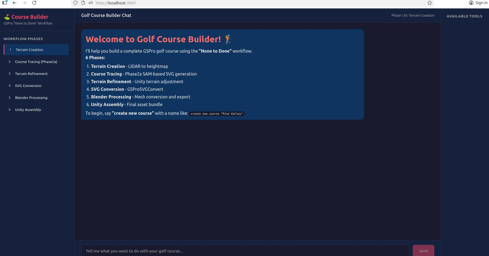

# Golf Course Builder

An automated pipeline for creating GSPro golf courses from satellite imagery and LIDAR data - the "None to Done" workflow.

## Overview

This project automates the complete workflow of building golf courses for GSPro, from raw terrain data to a finished playable asset bundle. The pipeline consists of multiple phases, each handled by specialized tools and components.

> See [plan.md](plan.md) for the full automation plan with detailed MCP tool specifications.

### GUI Preview



*This is a rough idea of what the GUI will look like - a chat interface for interacting with the course building agents and tools.*

## Architecture: GOAP + Nested Tools

This project combines **Goal-Oriented Action Planning (GOAP)** with the **Matryoshka Tool Pattern** to create an intelligent, autonomous course-building agent.

### What is GOAP?

Goal-Oriented Action Planning is an AI architecture originally developed by Jeff Orkin for the game F.E.A.R. to create intelligent NPC behavior. Rather than following rigid scripts, GOAP agents:

1. **Define Goals** - High-level objectives like "build complete golf course" or "generate terrain SVG"
2. **Track World State** - Current conditions such as "heightmap exists", "SVG validated", "FBX exported"
3. **Select Actions** - Available operations that have preconditions and effects on world state
4. **Plan Dynamically** - Automatically determine the sequence of actions needed to achieve the goal from the current state

### Why GOAP for Course Building?

The "None to Done" workflow is an ideal fit for GOAP because:

| GOAP Concept | Course Building Application |
|--------------|----------------------------|
| **Goals** | "Build complete course", "Create terrain from LIDAR", "Generate playable asset bundle" |
| **World State** | Workflow gates: `terrain_ready`, `svg_complete`, `fbx_exported`, `course_complete` |
| **Actions** | 50+ specialized tools: heightmap generation, SAM tracing, mesh operations, etc. |
| **Preconditions** | Phase dependencies (e.g., "terrain must exist before overlay can be applied") |
| **Effects** | Gate completions, file outputs, state transitions |

### GOAP + Nested Tools Synergy

The **Matryoshka Tool Pattern** (nested tools like Russian dolls) complements GOAP perfectly:

```
┌─────────────────────────────────────────────────────────────────┐
│  GOAP Planner                                                   │
│  ┌───────────────────────────────────────────────────────────┐  │
│  │  Goal: Build Complete Course                              │  │
│  │  Current State: {heightmap: ✓, svg: ✗, fbx: ✗}           │  │
│  │  → Plans: phase2a_mcp → svg_convert → blender_mcp → ...  │  │
│  └───────────────────────────────────────────────────────────┘  │
│                              │                                   │
│                              ▼                                   │
│  ┌───────────────────────────────────────────────────────────┐  │
│  │  Matryoshka Tools (Progressive Disclosure)                │  │
│  │                                                           │  │
│  │  golf_course_builder (top-level)                          │  │
│  │  └── phase2a_mcp ← GOAP selects this                      │  │
│  │      ├── phase2a_run                                      │  │
│  │      ├── phase2a_classify     ← Nested tools revealed     │  │
│  │      └── phase2a_generate_svg ← as needed                 │  │
│  └───────────────────────────────────────────────────────────┘  │
└─────────────────────────────────────────────────────────────────┘
```

**Key Benefits:**

1. **Reduced Complexity** - The planner sees only relevant tools at each decision point, not all 50+ operations
2. **Dynamic Replanning** - If a step fails (e.g., SAM tracing produces poor results), GOAP can replan with alternative actions
3. **Modular Goals** - Sub-goals map naturally to tool groups (Phase 1 tools → terrain goal, Phase 2A tools → tracing goal)
4. **Context Preservation** - Nested tools prevent LLM context pollution while GOAP maintains workflow state
5. **Flexible Execution** - The agent can adapt to different starting points (partial courses, retries, modifications)

## Project Components

| Component | Description | Documentation |
|-----------|-------------|---------------|
| **Phase 1** | QGIS/GDAL Terrain Preparation - DEM processing, heightmap generation | [phase1/README.md](phase1/README.md) |
| **Phase 2A** | Automated Satellite Tracing - SAM-based feature extraction to SVG | [phase2a/README.md](phase2a/README.md) |
| **Course Builder** | Spring Boot Agent Orchestration - Matryoshka tool pattern for workflow | [course-builder/README.md](course-builder/README.md) |

## The "None to Done" Workflow

The complete workflow transforms raw data into a playable GSPro course:

```
LIDAR → Unity (Terrain) → Phase2a (SAM SVG) → Unity (PNG) → Blender (Mesh) → Unity (Final)
```

### 6 Phases

1. **Terrain Creation** (Phase 1) - Generate heightmaps from LIDAR/DEM data, set up Unity terrain
2. **Course Tracing** (Phase 2A) - SAM-based automated satellite tracing to create SVG geometry
3. **Terrain Refinement** - Apply overlay, adjust contours, export OBJ
4. **SVG Conversion** - Process SVG for Blender import (GSProSVGConvert.exe)
5. **Blender Processing** - Mesh import, terrain projection, peripherals, FBX export
6. **Unity Assembly** - Import FBX, materials, vegetation, asset bundle build

## Quick Start

### Phase 1: Terrain Preparation

```bash
cd phase1
pip install -e .
phase1 run --course-name MyCourse -o workspace/
```

### Phase 2A: Satellite Tracing

```bash
cd phase2a
pip install -e .
phase2a run satellite.png --checkpoint models/sam_vit_h_4b8939.pth -o output/
```

### Course Builder Agent

```bash
cd course-builder
./mvnw spring-boot:run
```

## Project Structure

```
.
├── phase1/              # QGIS/GDAL terrain preparation (Python)
├── phase2a/             # SAM-based satellite tracing (Python)
├── course-builder/      # Agent orchestration (Spring Boot)
├── docs/                # Additional documentation
│   ├── TESTING.md
│   └── TEST_WALKTHROUGH.md
├── plan.md              # Full automation plan with MCP tool specs
└── phase2a.md           # Phase 2A design specification
```

## Requirements

### Phase 1
- Python 3.9+
- QGIS with PyQGIS bindings
- GDAL

### Phase 2A
- Python 3.10+
- SAM model checkpoint
- CUDA (recommended) or CPU

### Course Builder
- Java 17+
- Maven

## Documentation

- [Automation Plan](plan.md) - Complete workflow definition with MCP tool specifications
- [Phase 2A Specification](phase2a.md) - Detailed design for satellite tracing pipeline
- [Testing Guide](docs/TESTING.md) - How to run tests
- [Test Walkthrough](docs/TEST_WALKTHROUGH.md) - Step-by-step test execution guide

## References

- [Course Builder Documentation](https://docs.google.com/document/d/1InsfFuOrAH4l2S6RnTy17_O8FPXwt_EA_jKLvW4Ky80)
- [None to Done Video Series](https://docs.google.com/document/d/1bwNRByfPQNbUOWfKymXvdoWq9QP9-1R0U1GaJf5z9fU)
- [Course Builder Discord](https://discord.gg/4ZhJzwx)
- [Zeros and Ones GCD Tutorials](https://zerosandonesgcd.com/)
